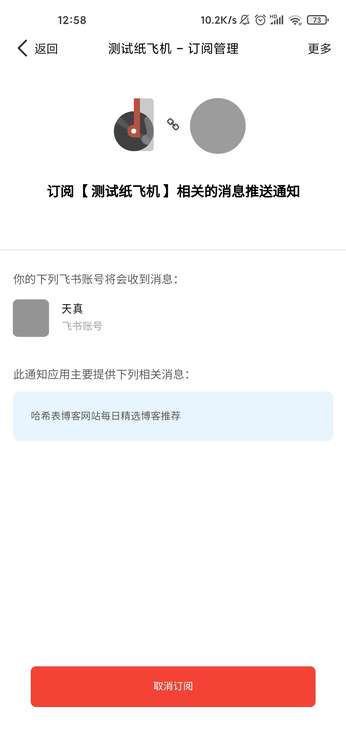
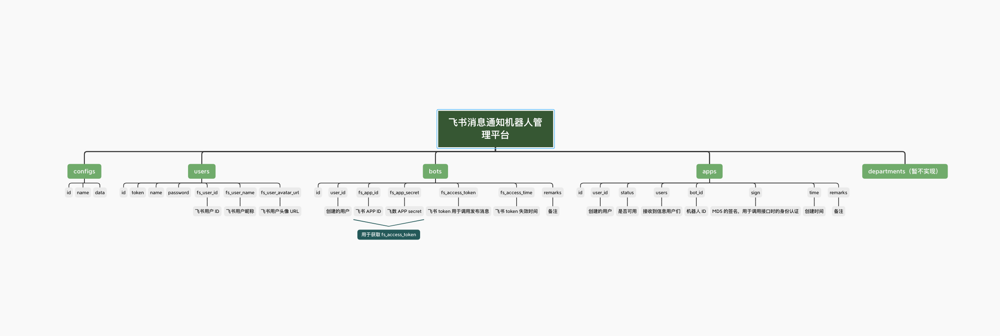

# PaperAirplane 纸飞机飞书消息推送管理平台 📬

> 基于但不限于飞书消息推送开发的管理平台。打造更方便，更高效，更开放，更有意思。


<br/>

## 技术栈 🎨

运行环境：Linux，PHP，Nginx，Mysql，Node

后端框架：[Laravel](https://github.com/laravel/laravel)

前端主要框架：[React](https://github.com/facebook/react), [laravel-mix](https://github.com/JeffreyWay/laravel-mix), [sass](https://www.npmjs.com/package/sass), [element-react](https://www.npmjs.com/package/element-react), [rsuite](https://www.npmjs.com/package/rsuite), [axios](https://www.npmjs.com/package/axios), [axios-hooks](https://www.npmjs.com/package/axios-hooks)

当前数据表结构：

<br/>

## 部署文档 🚀

1，获取项目代码

```
git clone https://github.com/haxibiao/PaperAirplane.git

cd PaperAirplane
```

2，配置 .env 文件

```
cp .env.example .env

vim .env
```

3，修改 .env 如下参数

```
APP_DEBUG=false
APP_URL=demo.haxibiao.com    # 这里填写域名

DB_CONNECTION=mysql
DB_HOST=127.0.0.1    # 这里填写 mysql 数据库地址
DB_PORT=3306    # 这里填写 mysql 数据库端口
DB_DATABASE=paperairplane    # 这里填写数据库名称
DB_USERNAME=root    # 这里填写数据库账号
DB_PASSWORD=   # 这里填写 mysql 数据库密码

# 下列配置文件需要从 open.feishu.cn 获取，详细获取教程可参照飞书应用对接使用文档创建一个
FS_BASE_APP_ID=""    # 这里填写一个默认的飞书 App ID
FS_BASE_APP_SECRET=""    # 这里填写一个默认的飞书 App Secret

```

4，生成一个 APP_KEY，进行数据库迁移，创建 admin 账号

```
php artisan key:generate

php artisan migrate

php artisan db:seed
```

5，编译前端资源
```
npm install && npm run prod
```

6，访问 http://域名/admin ,选择飞书登陆

如何使用 PaperAirplane 完成第一次消息推送：[点击查看飞书应用对接使用文档](https://haxibiao.feishu.cn/docs/doccnJMoBPX5g0kklGx1cv36Xuf?from=from_copylink)

## 开发者 🍗

基本代码目录结构：

```
.
├── app (Laravel 代码目录)
├── bootstrap
├── config (Laravel 配置)
├── database (Laravel 数据迁移)
├── docs (文档目录)
├── public (静态资源目录)
├── resources (前端页面目录)
├── routes (Laravel 路由)
├── storage (Laravel 缓存)
└── tests (Laravel 测试)
```

前端开发代码目录：

```
resources
├── css (css 资源目录)
├── js (React 程序脚手架代码目录)
│   ├── components (网站公用组件)
│   │   └── scss
│   ├── pages (网站页面代码目录)
│   │   ├── admin (后台管理页面)
│   │   │   ├── router (前端路由配置)
│   │   │   ├── screens (后台管理页面屏幕目录)
│   │   │   │   ├── apps (应用管理)
│   │   │   │   │   └── components
│   │   │   │   ├── bots (机器人管理)
│   │   │   │   │   └── components
│   │   │   │   ├── default (空状态)
│   │   │   │   ├── home (系统状态)
│   │   │   │   └── users (用户管理)
│   │   │   └── scss
│   │   ├── login (登陆页面)
│   │   │   └── scss
│   │   └── subscribe (订阅页面)
│   │       └── scss
│   └── store (数据缓存)
├── lang (国际化语言目录)
│   └── en
└── views (blade html 模版目录)
```

## License 📟

The PaperAirplane is open-sourced software licensed under the [MIT license](https://opensource.org/licenses/MIT).
